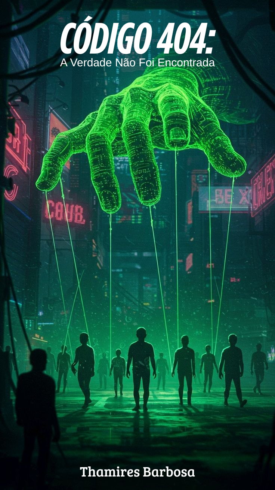

# Desafio-E-book-com-IA

# 📕 Código 404: A Verdade Não Foi Encontrada

[Baixe o eBook completo aqui (PDF)](Codigo_404_Thamires_Barbosa_eBook.pdf)

**Autora:** Thamires Barbosa  
**Gênero:** Ficção Hacker / Cyberpunk  
**Público-alvo:** Jovens e entusiastas de tecnologia  
**Formato:** eBook em PDF

---

## 🧠 Sobre o Projeto

Este projeto nasceu da ideia de criar uma história hacker voltada para o público jovem, misturando tecnologia, conspiração e uma estética inspirada em *Matrix*. O objetivo foi desenvolver um eBook de ficção com uma narrativa envolvente que abordasse temas como controle digital, manipulação de dados e a busca pela verdade em meio ao caos informacional.

O título, **"Código 404: A Verdade Não Foi Encontrada"**, faz referência ao clássico erro da web, mas aqui assume um sentido mais profundo — e inquietante.

---

## 💡 Inspiração

[PROMPT Chat-GPT] “Quero criar um eBook voltado para o universo hacker, com uma narrativa fictícia e envolvente, destinada ao público jovem. Não será um livro técnico, mas sim uma história de ficção com estética inspirada em Matrix, abordando temas como manipulação digital, conspiração e controle informacional.
Me dê algumas ideias de títulos criativos e impactantes que combinem com esse estilo. Em seguida, desenvolva uma história de aproximadamente 5 páginas baseada no título escolhido, com um enredo profundo e reflexivo.  Por fim, elabore um README detalhado, com todas essas informações organizadas, para que eu possa publicar este projeto no GitHub como um eBook aberto ao público.”

---

## 📝 Sinopse

> Em uma metrópole controlada por algoritmos, onde as pessoas acreditam viver suas próprias escolhas, um grupo de jovens hackers descobre que tudo ao seu redor é uma mentira — um sistema manipulado que apaga qualquer vestígio da verdade. Quando a mensagem “Código 404” aparece em uma investigação digital, eles percebem que há algo que ninguém deveria encontrar. Agora, escapar da ilusão pode ser a única chance de liberdade.

---

## 📄 Conteúdo do eBook

O eBook está dividido em capítulos curtos, com cerca de 5 páginas de conteúdo original, apresentando:

- Introdução ao universo distópico
- Apresentação dos protagonistas
- Descoberta do sistema manipulador
- Conflito interno e fuga
- Reflexão final e gancho para continuação

---

## 📎 Arquivos

- `Codigo_404_Thamires_Barbosa_eBook.pdf`: eBook completo em PDF.
- `capa-ebook.png`: arte da capa, criada com auxílio de IA.

---

## 🚀 Tecnologias e Ferramentas Utilizadas

- ChatGPT: geração da narrativa e conteúdo.  
- Canva: design gráfico da capa do eBook com elementos visuais inspirados no universo hacker.  
- Pinterest: referência visual para ambientação, paleta de cores e estilo da estética cyberpunk/distópica.

---

